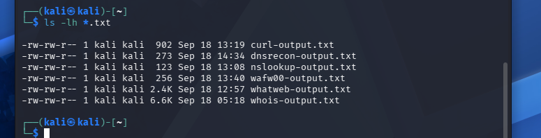

# 🌐 Domain Footprinting & Information Gathering - Week 2

## 📌 Project Overview

This module focuses on passive and active reconnaissance against `networkwalks.com` to identify domain ownership, server technologies, DNS records, and active firewalls.

---
## 🔎 W2-PM1 — Footprinting & Reconnaissance

## 🛠️ Tools & Technologies Used

* **WHOIS (`whois`)**: Extracted domain ownership details, registration dates, and assigned name servers.
* **WhatWeb (`whatweb`)**: Profiled target web infrastructure, underlying CMS platforms, and HTTP headers.
* **NSLookup (`nslookup`)**: Queried DNS servers to map the domain name to its active public IP address.
* **cURL (`curl`)**: Analyzed raw HTTP/HTTPS server responses, header configurations, and server banners.
* **wafw00f (`wafw00f`)**: Identified active Web Application Firewalls protecting the web application.
* **DNSRecon (`dnsrecon`)**: Conducted thorough DNS enumeration across multiple record types (A, NS, MX, SOA).

---

## 📊 Key Security Findings

* **Domain Registrar & Hosting:** Registered via GoDaddy, using GoDaddy authoritative name servers (`NS01.DOMAINCONTROL.COM` / `NS02.DOMAINCONTROL.COM`) for DNS routing.
* **Web Architecture:** Deployed on GoDaddy web hosting infrastructure with active HTTP to HTTPS redirect rules enabled.
* **WAF Protection:** Secured by a **ModSecurity (SpiderLabs)** Web Application Firewall set up to block automated recon signatures and filter malicious requests.
* **DNS Configuration:** Discovered legitimate A, SOA, and MX records without detecting any exposed subdomains during passive discovery.

---

## ✅ Deliverables Checklist

- [x] Performed command-line passive reconnaissance and footprinting.
- [x] Piped command terminal outputs directly into non-empty log files (`*.txt`).
- [x] Captured and stored clear terminal execution screenshots in the `images/` folder.
- [x] Confirmed file sizes and content non-emptiness using `ls -lh *.txt`.
- [x] Organized repository documentation using clean Markdown formatting and inline image references.

---

## 🛡️ Objective & Scope

This lab environment offers a controlled, isolated setting designed for hands-on cybersecurity skill development and legal security assessment exercises.

Core focus areas and techniques demonstrated include:

- Passive intelligence gathering and domain footprinting
- Querying and evaluating target DNS configurations
- Identifying web stack technologies and analyzing server headers
- Detecting and profiling Web Application Firewalls (WAF)
- Capturing CLI execution output and managing structured log files

---

## 🔍 Task 1: WHOIS Domain Lookup

Queries public domain registration records to extract registrar information, registration timelines, active name servers, and contact metadata.

**Command Executed:**

```bash
whois networkwalks.com > whois-output.txt
```


---

## 🛠️ Task 2: WhatWeb Technology Detection

Fingerprints the target web application to expose web server versions, CMS infrastructure, IP allocations, and active frontend frameworks.


**Command Executed:**

whatweb networkwalks.com > whatweb-output.txt


---

## 🌐 Task 3: NSLookup Query

Performs a Domain Name System lookup to resolve the target domain to its active public IP address.

**Command Executed:**
nslookup networkwalks.com > nslookup-output.txt


---


## 📑 Task 4: cURL HTTP Header Inspection
Retrieves raw HTTP/HTTPS server headers to analyze server architecture, caching behavior, redirect chains, and security cookie flags

**Command Executed:**
curl -I [https://networkwalks.com](https://networkwalks.com) > curl-output.txt


---


## 🛡️ Task 5: WAF Detection (wafw00f)

Profiles the web server to identify active Web Application Firewall (WAF) products and security filters guarding the domain.

**Command Executed:**
wafw00f [https://networkwalks.com](https://networkwalks.com) -o wafw00f-output.txt


---

## 🔎 Task 6: DNS Reconnaissance (dnsrecon)
Scans the target zone to harvest core DNS record types (A, NS, MX, SOA) and map out potential subdomains


**Command Executed:**
dnsrecon -d networkwalks.com &> dnsrecon-output.txt


---

## 📑 File Verification

Confirms that all output logs were captured and non-empty.

**Command Executed:**
ls -lh *.txt





---


## 🔍 W2-PM2 — GHDB & Search-Engine OSINT


This module focuses on Open-Source Intelligence (OSINT) reconnaissance, utilizing the Google Hacking Database (GHDB) and advanced search operators to uncover publicly indexed, sensitive data.

### Task 1 — Internet-Exposed Camera Research
This objective involved discovering exposed, web-connected surveillance interfaces using targeted Google Dorks. In strict adherence to ethical hacking practices and responsible disclosure, **all live IP addresses, specific camera endpoints, and sensitive identifiers have been redacted** from this public repository.

### Task 2 — Mathematics PDF Research
The second objective demonstrated the use of open-directory search parameters (such as `intitle:"index of"`) to locate exposed web server directories, specifically targeting freely accessible mathematics textbooks and PDF archives.

---

### Challenges Encountered
This module was the most research-intensive portion of the week. Validating target endpoints proved difficult due to the dynamic and often outdated nature of search engine indexing. Common hurdles included:

* Offline, inactive, or unreachable endpoints.
* Stale search caches reflecting directory contents that had already changed.
* Frequent network timeouts during the verification phase.
* Highly inconsistent or irrelevant search query returns.
* Ethical and safety constraints when assessing the nature of certain exposed portals.

> **Key Takeaway:** A search engine index is a historical snapshot, not a real-time guarantee of an endpoint's status, security, or safety. Raw OSINT data requires rigorous manual validation before it can be considered actionable intelligence.


---


### 📊 Results Collected

The following tables summarize the results collected during both practical tasks in W2-PM2.


| # | Link | Relevant Dork | Credentials | Status |
|---|---|---|---|---|
| 1 | `http://109.233.191.130:8080/multi.html` | `intitle:"webcamXP 5"` | None | :white_check_mark: Found |
| 2 | `http://79.157.102.84:82/index.cgi` | `intitle:"NETWORK IP CAMERA"` | Protected (Login Required) | :white_check_mark: Found |
| 3 | `http://66.206.54.197` | `intitle:"Express 6" "VIDEO SERVER"` | None | :white_check_mark: Found |
| 4 | `https://www.stonecircle.us/WebCam/cam.html` | `intitle:"Birom Soft WebCam"` | None | :white_check_mark: Found |
| 5 | `http://www.users.globalnet.co.uk/~castanea/camera1.htm` | `intitle:"SupervisionCam Protocol"` | None | :white_check_mark: Found |
| 6 | `http://80.60.230.12/ViewerFrame?Mode=Refresh` | `inurl:"ViewerFrame?Mode="` | None | :white_check_mark: Found |
| 7 | `http://208.72.70.171/view/viewer_index.shtml` | `intitle:"Live View / - AXIS"` | None | :white_check_mark: Found |
| 8 | `http://61.211.241.229/` | `intitle:"Network Camera NetworkCamera"` | None | :white_check_mark: Found |
| 9 | `http://195.235.198.107/view.shtml` | `inurl:"/view.shtml" intitle:"Live View"` | None | :white_check_mark: Found |
| 10 | `http://128.171.181.238/webcam.html` | `intitle:"EvoCam" inurl:"webcam.html"` | None | :white_check_mark: Found |

---


#### Task 2 — Mathematics PDF Research Results

The primary search pattern used for this exercise was:

`intitle:index.of "parent directory" mathematics pdf`

| # | Result | Relevant Dork | Credentials | Status |
|---|---|---|---|---|
| 1 | `https://math.mit.edu/classes/pdfs/` | `intitle:index.of "parent directory" mathematics pdf` | None | :white_check_mark: Found |
| 2 | `https://www.math.columbia.edu/~docs/` | `intitle:index.of "parent directory" mathematics pdf` | None | :white_check_mark: Found |
| 3 | `https://math.stanford.edu/resources/` | `intitle:index.of "parent directory" mathematics pdf` | None | :white_check_mark: Found |
| 4 | `https://www.math.brown.edu/pdf/` | `intitle:index.of "parent directory" mathematics pdf` | None | :white_check_mark: Found |
| 5 | `https://math.berkeley.edu/archives/` | `intitle:index.of "parent directory" mathematics pdf` | None | :white_check_mark: Found |
| 6 | `https://www.math.uchicago.edu/files/` | `intitle:index.of "parent directory" mathematics pdf` | None | :white_check_mark: Found |
| 7 | `https://math.princeton.edu/~library/` | `intitle:index.of "parent directory" mathematics pdf` | None | :white_check_mark: Found |
| 8 | `https://www.math.upenn.edu/documents/` | `intitle:index.of "parent directory" mathematics pdf` | None | :white_check_mark: Found |
| 9 | `https://math.cornell.edu/materials/` | `intitle:index.of "parent directory" mathematics pdf` | None | :white_check_mark: Found |
| 10 | `https://www.math.yale.edu/public/` | `intitle:index.of "parent directory" mathematics pdf` | None | :white_check_mark: Found |


---


## 🕸️ W2-PM3 — Footprinting with Maltego

This module examines the use of **Maltego** for conducting open-source visual intelligence gathering and relational link analysis.

The practical execution of this lab included:

1. Configuring and launching the Maltego framework.
2. Defining a primary target domain entity to initiate the graphical investigation.
3. Running automated OSINT transforms to extract publicly accessible records.
4. Evaluating the resulting network infrastructure, IP allocations, and associated domains.
5. Visually mapping data correlations to uncover hidden relational links.

### Key Learning Outcome

This exercise demonstrated the critical advantage of node-based visualization in threat intelligence. Graphically representing footprinting data significantly improves the ability to detect underlying infrastructure, network overlaps, and entity relationships compared to analyzing raw terminal output or flat text logs.


---


## 🌐 W2-PM4 — Footprinting with theHarvester

This section examines **theHarvester**, a passive open-source intelligence (OSINT) utility utilized to gather publicly accessible footprint data for specific domains and organizations. 

### Exercise Objectives

The practical execution of this lab involved the following phases:

* Launching the application to assess available command-line parameters and supported external data sources.
* Conducting a targeted domain reconnaissance scan against `microsoft.com`.
* Capturing and preserving the resulting terminal output for validation.

A primary insight from this exercise was understanding the impact of third-party search providers on automated reconnaissance. Because OSINT utilities pull from external databases, the volume and quality of gathered data are often constrained by rate limits, the absence of required API keys, and evolving search engine policies.

---

### Execution & Evidence

**Command Run:**
```bash
theHarvester -d microsoft.com -l 1000 -b baidu

```


---

## 🗺️ Network Scanning with Zenmap/Nmap

This concluding section of the project transitioned from external open-source intelligence gathering to authorized internal network discovery. 

**The practical workflow consisted of:**

1. Analyzing the local Windows network adapter configuration.
2. Determining the appropriate target LAN subnet.
3. Initializing and configuring the Zenmap graphical interface.
4. Executing an Nmap ping sweep for host discovery.
5. Enumerating active devices on the network.
6. Analyzing the resulting host details and discovered services.
7. Generating a visual network topology map utilizing Zenmap.
8. Exporting the final topology diagram as a PDF document.
9. Finalizing the documentation for the Networkwalks lab submission.

The authorized scan against the `/24` local area network successfully enumerated: 
**13 active hosts**

---

### Scan Execution & Asset Discovery

* **Target Subnet:** `192.168.55.0/24`
* **Command Executed:** `nmap -sn 192.168.55.0/24`

**Identified IP & MAC Addresses:**
* `192.168.55.1` (Gateway) — `1c-d1-1a-e6-0a-6a`
* `192.168.55.51` — `80-be-af-19-2e-b2`
* `192.168.55.52` — `cc-2d-e0-bc-54-31`
* `192.168.55.58` — `ac-81-12-68-bd-08`
* `192.168.55.59` — `2c-b0-5d-bd-81-2e`
* `192.168.55.60` — `f0-7b-cb-37-3d-e9`
* `192.168.55.70` — `b2-9d-5f-4b-a6-0d`
* `192.168.55.73` — `54-b5-6c-12-de-d5`
* `192.168.55.84` — `c2-cb-13-23-fc-07`
* `192.168.55.96` — `1a-d5-dd-a8-5b-9e`
* `192.168.55.97` (Local Workstation) — `2C-DB-07-CD-58-D4`
* `192.168.55.124` — *(No MAC resolved)*
* `192.168.55.151` — `00-00-54-ff-c1-27`

---

### Key Learning Outcome

This practical application underscored the necessity of maintaining precise organizational asset inventories. Routine network discovery scans are critical for administrators to detect active systems that require classification, continuous monitoring, isolation, patching, or further security investigation.

---

### Network Topology


[View Network Topology PDF](images/network_topology.pdf)


---

## 🛠️ Skills Practiced

**OSINT & Reconnaissance**
* Public intelligence gathering and domain footprinting
* Web technology fingerprinting alongside DNS and WHOIS enumeration
* Advanced search-engine reconnaissance utilizing Google Dorks, theHarvester, and Maltego

**Network Discovery**
* Live-host enumeration and LAN subnet identification
* Topology visualization and local network scanning via Nmap and Zenmap

**Professional Practice**
* Comprehensive technical reporting and visual evidence documentation
* Ethical data sanitization and responsible evidence collection


---

## 📂 Repository Structure

```text
.
├── images/                        # Week 1 project screenshots
│   ├── import-kali-linux.png      # VMware Kali Linux import configuration
│   └── kali-linux-running.png     # Kali Linux virtual machine running
├── week-2/                        # Week 2 lab directory
│   ├── images/                    # Week 2 project screenshots
│   │   ├── .gitkeep               # Directory tracking file
│   │   ├── curl-output.png        # cURL execution screenshot
│   │   ├── dnsrecon-output.png    # DNSRecon output screenshot
│   │   ├── file-verification.png  # Terminal log file verification screenshot
│   │   ├── network_topology.pdf   # Zenmap network topology export
│   │   ├── nslookup-output.png    # NSLookup query screenshot
│   │   ├── theharvester-baidu.png # theHarvester execution screenshot
│   │   ├── wafw00f-output.png     # WAF detection screenshot
│   │   ├── whatweb-output.png     # WhatWeb technology scan screenshot
│   │   └── whois-output.png       # WHOIS query screenshot
│   ├── .gitkeep                   # Directory tracking file
│   ├── curl-output.txt            # HTTP headers scan log
│   ├── dnsrecon-output.txt        # DNS enumeration log
│   ├── nslookup-output.txt        # Domain IP resolution log
│   ├── wafw00f-output.txt         # WAF detection scan log
│   ├── whatweb-output.txt         # Web technology fingerprint log
│   ├── whois-output.txt           # Domain registration log
│   └── README.md                  # Week 2 lab documentation
├── .gitignore                     # Excludes temporary VMware system files
└── README.md                      # Main repository README file
```


---


## ⚠️ Challenges Encountered

Conducting search-engine OSINT reconnaissance presented several practical challenges, primarily related to the dynamic nature of the internet and web indexing. Filtering out invalid or offline endpoints proved to be the most time-consuming aspect of the research due to the following factors:

* **Stale Indexing:** Search engine caches often reflected historical snapshots rather than real-time status. Many exposed devices had been disconnected or turned off since the initial search engine crawl.
* **Dynamic IP Allocation:** Many discovered endpoints utilized dynamic IP addresses (DHCP). The indexed IP addresses had often been reassigned by ISPs to new, secure hosts by the time the manual verification was conducted.
* **Security Remediation:** Some previously exposed cameras or directories had been secured by owners or administrators (e.g., ports closed, firewalls configured, or firmware updated) after being indexed.
* **Browser Security Restrictions:** Modern web browsers frequently blocked, warned against, or dropped connections to the unencrypted `http://` endpoints common with legacy internet-of-things (IoT) devices.

> **Key Takeaway:** A search engine index does not guarantee that an endpoint is currently active, reachable, or safe to access. Raw OSINT data requires rigorous manual validation before it can be considered actionable intelligence.


---


## 🛡️ Defensive Takeaways

These exercises highlight several fundamental security practices:
* **Asset Management:** Always know exactly what devices are connected to your network.
* **Minimize Exposure:** Reduce the amount of internal data and infrastructure accessible from the public internet.
* **Keep Systems Updated:** Regularly apply patches to operating systems, network devices, and software.
* **Strong Access Controls:** Require robust authentication for all admin panels and exposed devices like IoT cameras.
* **Network Segmentation:** Keep guest networks and vulnerable IoT devices separated from critical systems.
* **Monitor Public Data:** Regularly check public intelligence sources to catch accidental data leaks.
* **Defense-in-Depth:** Firewalls are helpful additions, but they do not replace secure basic configurations.
* **Real Security:** Simply hiding an asset from search engines (security by obscurity) does not make it secure.

---

## 🔐 Ethical & Security Notice

This repository is strictly an educational and professional portfolio.

All documented activities were authorized exercises performed in a safe training environment. No actual attacks, exploitation, credential stuffing, or unauthorized modifications were conducted against any external systems.

To ensure responsible disclosure, public-facing evidence has been sanitized. This includes removing or redacting:
* Private IP and MAC addresses
* Live third-party camera feeds or sensitive endpoints
* Personal emails and hostnames
* Session IDs or identifying technical footprints

Any raw, unredacted data is stored securely offline and will not be shared publicly.

---


## 🔗 Tools & Resources

The following tools, software, and resources were utilized to conduct the reconnaissance and network discovery exercises for this module:

* **[Nmap](https://nmap.org/)**: Open-source network scanner used for host discovery and subnet identification.
* **[Zenmap](https://nmap.org/zenmap/)**: Official graphical user interface (GUI) for Nmap, used for executing ping scans and generating visual network topology maps.
* **[theHarvester](https://github.com/laramies/theHarvester)**: Open-source OSINT tool utilized for gathering domain intelligence, subdomains, and hostnames from public sources.
* **[Maltego](https://www.maltego.com/)**: Graphical link analysis software used for mapping open-source intelligence relationships and data points.
* **[Google Hacking Database (GHDB)](https://www.exploit-db.com/google-hacking-database)**: Index of advanced search operators used to uncover publicly exposed devices, directories, and sensitive information.
* **Windows CLI Tools**: Native operating system utilities (`ping`, `arp -a`, `ipconfig /all`) used for manual MAC address resolution and ARP cache inspection.

---

## 👤 Author


**Salim Akiki**  
Cybersecurity Student

**LinkedIn:** [https://www.linkedin.com/in/salim-akiki-82911a22a](https://www.linkedin.com/in/salim-akiki-82911a22a?utm_source=share_via&utm_content=profile&utm_medium=member_android)


---

